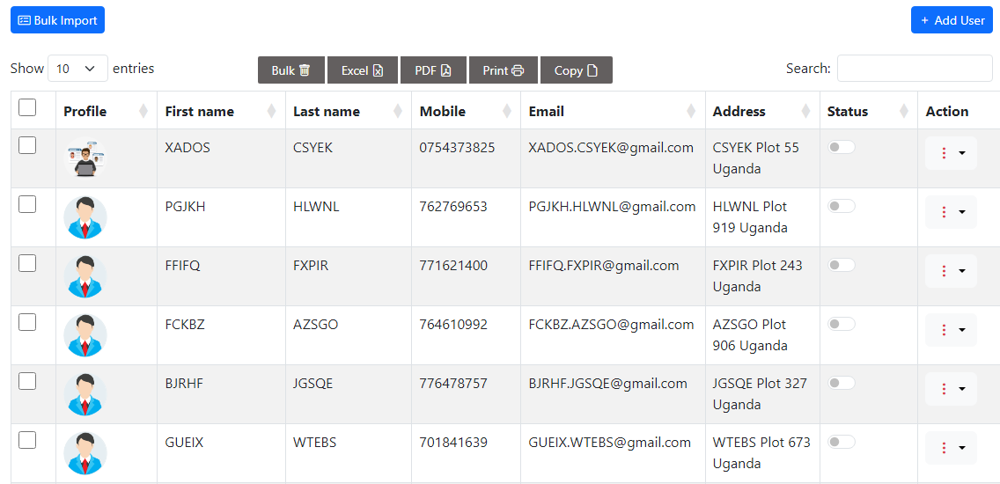

<table>
  <tr>
    <td>
      
    </td>
  </tr>
</table>

# CodeIgniter 4 CRUD Application with Bootstrap 5, jQuery, Bootstrap 5 DataTables, SweetAlerts, Bootstrap Icons

This is a CRUD (Create, Read, Update, Delete) web application built using CodeIgniter 4, integrated with various technologies such as Bootstrap 5, jQuery, Bootstrap 5 DataTables, SweetAlerts, and Bootstrap Icons. This application implements AJAX CRUD operations with server-side data fetching for optimal performance.

## Features

- **CRUD Operations:** Perform Create, Read, Update, and Delete operations on your data.

- **Server-side Data Fetching:** Utilizes server-side processing for DataTables, ensuring efficient data retrieval.

- **Bulk Delete:** Easily delete multiple records at once using the bulk delete feature.

- **Bulk Import CSV Data:** Import data in bulk from CSV files, making it convenient to add large datasets.

- **jQuery Validation Library:** Implements client-side form validation for data input.

## Technologies Used

- **CodeIgniter 4:** A powerful PHP framework for building web applications.

- **Bootstrap 5:** A popular front-end framework for responsive web design.

- **jQuery:** A fast, small, and feature-rich JavaScript library.

- **Bootstrap 5 DataTables:** A jQuery plugin for creating dynamic, interactive data tables.

- **SweetAlerts:** A beautiful and customizable replacement for JavaScript's native alert(), confirm(), and prompt() dialogs.

- **Bootstrap Icons:** A collection of free, high-quality SVG icons for use with Bootstrap.

## Installation and Setup

1. Clone the repository to your local environment:

   ```shell
   git clone https://github.com/Abaspanda/codeigniter4_ajax_crud.git
   ```

2. Navigate to the project directory:

   ```shell
   cd your-project-directory
   ```

3. Create a copy of the `.env` file and configure your database settings:

   ```shell
   cp env and rename the new copy to .env
   ```
4. Goto public directory and copy .htaccess with index.php and paste the two files to root directory
- .htaccess
- .index.php

5. Goto into the copied index.php file pasted in root directory and adjust as follows
- On line 32 change require FCPATH . '../app/Config/Paths.php'; To require FCPATH . '/app/Config/Paths.php';

6. Goto to .env file and adjust the following
- Update the `database.default` section in the `.env` file with your database credentials.
- Update line 17 in the .env from #CI_ENVIRONMENT = production to CI_ENVIRONMENT = development
- Update line 23 in the .env from #app.baseURL = '' to app.baseURL = 'http://localhost/your-project-directory'

7. Create a database to your appropiate name, this name should much the one in .env database.default.database

8. Run database migrations to create the necessary tables:

   ```shell
   php spark migrate
   ```

9. Start the application:

   ```shell
   http://localhost/your-project-directory
   ```

   The application will be accessible at `http://localhost/your-project-directory`.

## Usage

1. Navigate to the application in your web browser.

2. You can perform CRUD operations on the data entities provided by the application.

3. To use the bulk delete and bulk import CSV features, navigate to the respective sections and follow the on-screen instructions.

4. Form validation using jQuery will ensure data integrity.

## How to import CSV file
- The excel csv file has been included in this **repo**, use it for a quick setup of the application
- **Note!** I forgot to format the contact's column to accept text for numbers, please fix that during update of data  

## Contributing

Contributions are welcome! If you have any improvements or additional features to suggest, please open an issue or submit a pull request.

## License

This project is licensed under the MIT License - see the [LICENSE](LICENSE) file for details.

---

Feel free to explore, customize, and use this CodeIgniter 4 CRUD application with Bootstrap 5 DataTables and other technologies for your own projects. If you encounter any issues or have questions, please don't hesitate to reach out. Enjoy building your web applications!

## Author Contact Details

- **Email** master.kisekka@gmail.com or panda.abas@hotmail.com
- **Contact** (+256) 751500914 or (+256) 782237400
